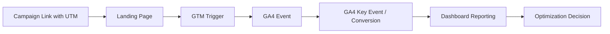

# Project 2: GTM + GA4 Measurement Dashboard System

A portfolio-ready measurement planning project that shows how campaign traffic, UTM governance, GTM events, GA4 key events, and reporting dashboards connect together.

## Project Goal

Build a practical measurement system for a lead-generation website so marketing teams can understand:

- Which campaigns are driving traffic
- Which users are engaging after landing
- Which actions should be tracked as conversions / key events
- Which events are missing required parameters
- Whether UTM links are clean and reporting-ready
- What dashboard views a performance marketer or manager should monitor

## Why This Project Matters

Most campaigns fail to report properly because tracking is incomplete, UTM naming is inconsistent, events are not planned before launch, and CRM lead quality is not connected back to campaign reporting.

This project solves that by creating a structured measurement plan before campaign launch.

## System Flow



## What This Module Includes

| File / Folder | Purpose |
|---|---|
| `app.py` | Streamlit measurement dashboard for reviewing events, UTMs, QA, and reporting readiness |
| `requirements.txt` | Python dependencies for the Project 2 app |
| `sample-data/campaign_urls.csv` | Sample campaign links with UTM parameters |
| `sample-data/ga4_event_taxonomy.csv` | Event taxonomy for GA4-style measurement planning |
| `src/validate_measurement_plan.py` | Python validation logic for UTMs and GA4 event plan quality |
| `docs/gtm-ga4-measurement-blueprint.md` | GTM + GA4 setup blueprint |
| `docs/dashboard-spec.md` | Dashboard layout and reporting specification |
| `docs/qa-checklist.md` | Pre-launch QA checklist for GTM/GA4 tracking |

## Key Concepts Demonstrated

- UTM governance
- Campaign source / medium / campaign naming consistency
- GA4 event taxonomy planning
- GTM tags, triggers, and variables
- Key event / conversion planning
- Tracking QA before campaign launch
- Dashboard specification for campaign reporting
- Marketing operations documentation

## Sample Use Case

A business is running Google Ads, Meta Ads, LinkedIn Ads, and email campaigns to generate leads. The marketing team needs a measurement system that can track:

- Page views
- Scroll depth
- CTA clicks
- Form starts
- Form submissions
- Thank-you page views
- WhatsApp / call clicks
- Qualified leads
- Campaign source and medium

## Run Locally

```bash
cd 02-gtm-ga4-measurement-dashboard-system
python -m pip install -r requirements.txt
python src/validate_measurement_plan.py
python -m streamlit run app.py
```

## Public Portfolio Positioning

> Designed a GTM + GA4 measurement planning system for lead-generation campaigns, including UTM governance, event taxonomy, key event mapping, QA checks, and dashboard reporting structure.

## Recruiter-Friendly Skills

- GA4 measurement planning
- Google Tag Manager planning
- UTM strategy
- Conversion tracking logic
- Campaign reporting structure
- Python + Pandas validation
- Streamlit dashboarding
- Marketing operations documentation

## Security Note

This project uses only sample data. Do not commit live GA4 measurement IDs, GTM container IDs, API tokens, CRM exports, or real client data.
