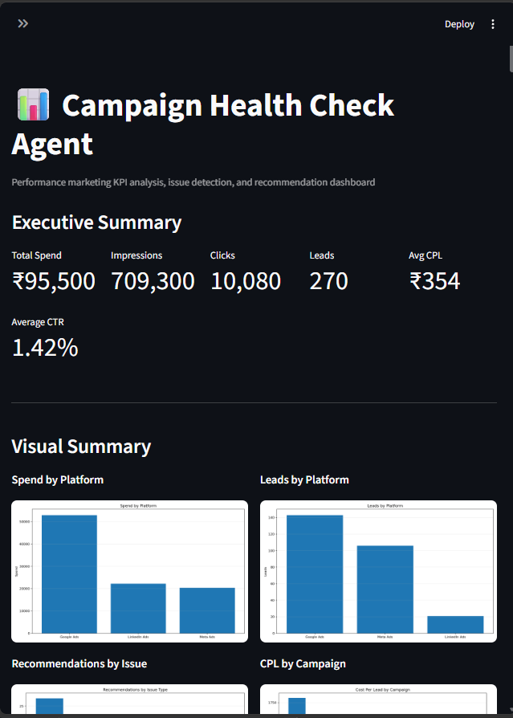
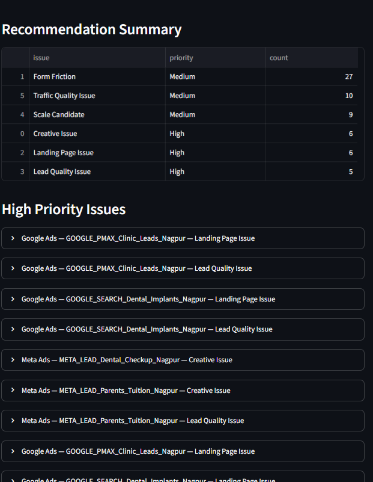
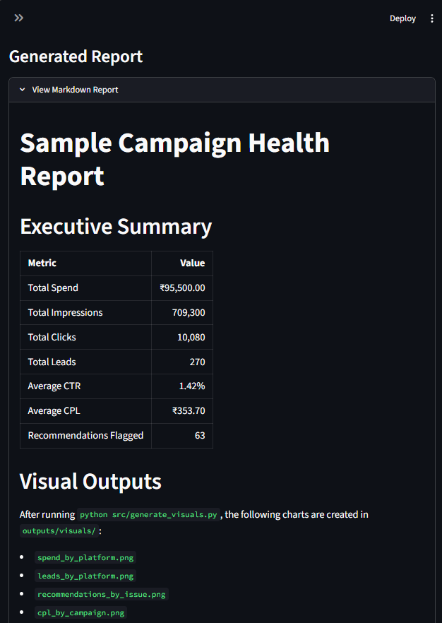
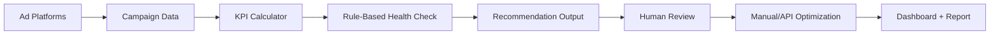
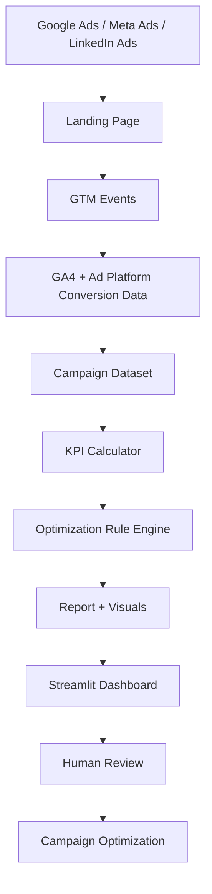
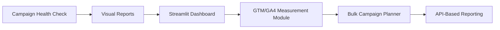

# 🚀 AI Performance Marketing Automation Lab

<p align="center">
  
</p>

<p align="center">
  
  
  
  
  
</p>

## 🎯 Project Overview

A performance marketing automation case study focused on campaign health checks, KPI analysis, measurement planning, dashboard reporting, UTM governance, and human-approved optimization workflows.

The project demonstrates how paid media data can be converted into structured insights for budget control, campaign prioritization, reporting, and optimization decisions.

> **Core idea:** Campaign optimization should be driven by clean tracking, meaningful KPIs, lead quality signals, and explainable recommendations.

---

## 🖥️ Interactive Dashboard Preview

<p align="center">
  
</p>

<p align="center">
  
  
</p>

---

## 🧠 Workflow



---

## 📦 Repository Modules

| Module | Purpose | Key Skills Demonstrated |
|---|---|---|
| [`01-ai-campaign-health-check-agent`](01-ai-campaign-health-check-agent/) | Analyze campaign data and generate optimization recommendations | KPI analysis, rule-based logic, reporting, visual dashboard, wasted-spend detection |
| `02-gtm-ga4-measurement-dashboard-system` | Design campaign measurement and dashboard structure | GTM, GA4 events, UTM strategy, conversion QA, dashboard planning |
| `03-bulk-campaign-planner-utm-builder` | Prepare scalable campaign launch templates | Campaign naming, UTM builder, bulk planning, pre-launch QA |
| [`docs`](docs/) | Shared documentation and SOPs | Process design, troubleshooting, documentation |
| [`assets`](assets/) | Screenshots, diagrams, and dashboard visuals | Portfolio presentation support |

---

## 🛠️ Tools & Skills Covered

| Category | Tools / Skills |
|---|---|
| Performance Marketing | Google Ads, Meta Ads, LinkedIn Campaigns, Remarketing, A/B Testing, Campaign QA |
| Tracking & Analytics | GTM, GA4, UTM Tracking, Enhanced Conversions concepts, Looker Studio |
| Automation | Python, Pandas, Matplotlib, Streamlit, Google Sheets, GitHub Actions concepts |
| AI-Assisted Workflow | Campaign analysis, rule explanation, reporting summaries, recommendation logic |
| Data & Reporting | Excel, dashboard planning, KPI definitions, sample datasets, campaign reports |
| Marketing Operations | Lead quality, budget pacing, funnel diagnosis, landing page issue detection |

---

## 📊 Campaign Health Logic

| Signal | Possible Issue | Recommended Action |
|---|---|---|
| High spend + zero leads | Wasted spend | Check tracking, landing page, audience, and keywords before scaling |
| High impressions + low CTR | Creative or offer issue | Test new hooks, visuals, headlines, and CTAs |
| High clicks + low leads | Landing page issue | Review page speed, CTA clarity, form visibility, and offer match |
| High form starts + low submits | Form friction | Reduce fields, improve mobile form UX, check form errors |
| Low CPL + good lead quality | Scale candidate | Increase budget gradually and monitor quality |
| Good lead volume + poor quality | Lead quality issue | Improve targeting, add qualifying questions, connect CRM feedback |

---

## 🏗️ System Architecture



---

## 📁 Project Status

| Area | Status |
|---|---|
| Repository setup | ✅ Done |
| Dashboard preview visual | ✅ Done |
| Campaign health check module | ✅ Done |
| Sample campaign data | ✅ Done |
| KPI calculator | ✅ Done |
| Rule engine | ✅ Done |
| Sample report output | ✅ Done |
| Campaign charts | ✅ Done |
| Streamlit dashboard | ✅ Done |
| GTM/GA4 measurement module | ⏳ Upcoming |
| UTM builder module | ⏳ Upcoming |

---

## 🖼️ Current Outputs

Project 1 generates:

- [`campaign_kpis.csv`](01-ai-campaign-health-check-agent/outputs/campaign_kpis.csv)
- [`campaign_recommendations.csv`](01-ai-campaign-health-check-agent/outputs/campaign_recommendations.csv)
- [`sample-campaign-health-report.md`](01-ai-campaign-health-check-agent/outputs/sample-campaign-health-report.md)
- Campaign visual charts in [`outputs/visuals`](01-ai-campaign-health-check-agent/outputs/visuals/)
- Interactive dashboard through [`app.py`](01-ai-campaign-health-check-agent/app.py)

---

## ▶️ Run Project 1 Locally

```bash
cd 01-ai-campaign-health-check-agent
python -m pip install -r requirements.txt
python src/calculate_kpis.py
python src/rule_engine.py
python src/generate_visuals.py
python -m streamlit run app.py
```

---

## 👨‍💼 Professional Use Case

This project is relevant for roles such as:

- Performance Marketing Executive
- Digital Marketing Executive
- Campaign Analyst
- Marketing Automation Executive
- Growth Marketing Associate
- Marketing Operations Associate
- Ads Operations Specialist
- B2B Lead Generation Specialist

---

## 🔐 Security Note

This repository uses sample/demo data only.

Do not commit:

- API keys
- Google Ads tokens
- Meta access tokens
- GA4 credentials
- `.env` files
- Service account JSON files
- Real client campaign data

---

## 🧭 Roadmap



---

## 📌 Portfolio Positioning

> **AI-assisted performance marketing automation using campaign analytics, conversion tracking logic, visual reporting, dashboarding, and safe optimization workflows.**
