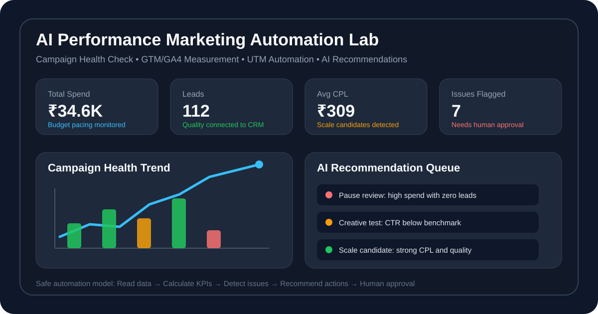
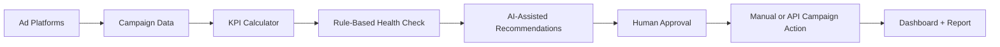
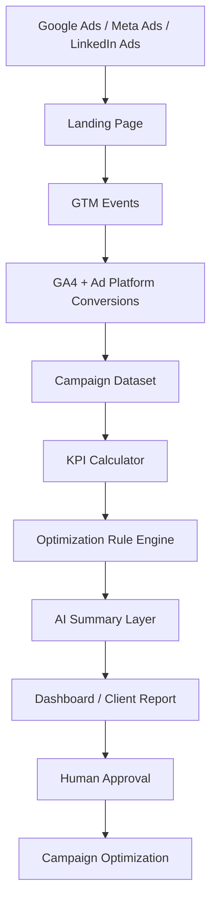
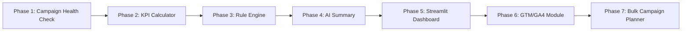

# 🚀 AI Performance Marketing Automation Lab

  

  
  
  
  
  

## 🎯 Project Summary

A practical portfolio lab for building industry-ready skills in **performance marketing, campaign analytics, GTM/GA4 measurement planning, dashboard reporting, UTM automation, and AI-assisted optimization workflows**.

This repository simulates how performance marketing teams work in agencies, SaaS companies, and growth teams: campaign data is collected, cleaned, analyzed, converted into insights, and used to make controlled optimization decisions.

> **Core idea:** Ads should not be optimized only by guesswork. They should be optimized using tracking, campaign KPIs, lead quality, dashboard reporting, and human-approved automation.

---

## 🧠 What This Lab Demonstrates

This project follows a safe commercial workflow:

1. Read campaign data.
2. Calculate KPIs.
3. Apply rule-based checks.
4. Generate AI-assisted recommendations.
5. Human reviews and approves.
6. Campaign changes are applied manually first, then through API only after testing.

The goal is **controlled, explainable, and human-approved optimization**, not uncontrolled AI changes to live campaigns.

---

## 📦 Repository Modules

| Module | Purpose | Key Skills Demonstrated |
|---|---|---|
| [`01-ai-campaign-health-check-agent`](01-ai-campaign-health-check-agent/) | Analyze campaign performance and generate optimization recommendations | KPI analysis, rule-based logic, AI reporting, wasted-spend detection |
| `02-gtm-ga4-measurement-dashboard-system` | Design a tracking and measurement system for ad campaigns | GTM, GA4 events, UTM strategy, conversion QA, dashboard planning |
| `03-bulk-campaign-planner-utm-builder` | Prepare scalable campaign launch templates | Campaign naming, UTM builder, bulk planning, pre-launch QA |
| [`docs`](docs/) | Shared documentation and SOPs | Process design, troubleshooting, professional documentation |
| `sample-data` | Sample data for practice and demo reports | Google Ads, Meta Ads, GA4-style campaign data |
| [`assets`](assets/) | Screenshots, diagrams, and dashboard visuals | Portfolio presentation support |

---

## 🛠️ Tools & Skills Covered

| Category | Tools / Skills |
|---|---|
| Performance Marketing | Google Ads, Meta Ads, LinkedIn Campaigns, Remarketing, A/B Testing, Campaign QA |
| Tracking & Analytics | GTM, GA4, UTM Tracking, Enhanced Conversions concepts, Looker Studio |
| Automation | Python, Pandas, Google Sheets, GitHub Actions, n8n/Make/Zapier workflow concepts |
| AI Layer | AI-assisted campaign analysis, rule explanation, reporting summaries, recommendation logic |
| Data & Reporting | Excel, dashboard planning, KPI definitions, sample datasets, campaign reports |
| Commercial Thinking | Lead quality, budget pacing, funnel diagnosis, landing page issue detection |

---

## 📊 Sample Campaign Health Logic

| Signal | Possible Issue | Recommended Action |
|---|---|---|
| High spend + zero leads | Wasted spend | Check tracking, landing page, audience, and keywords before scaling |
| High impressions + low CTR | Creative or offer issue | Test new hooks, visuals, headlines, and CTAs |
| High clicks + low leads | Landing page issue | Review page speed, CTA clarity, form visibility, and offer match |
| High form starts + low submits | Form friction | Reduce fields, improve mobile form UX, check form errors |
| Low CPL + good lead quality | Scale candidate | Increase budget gradually and monitor quality |
| Good lead volume + poor quality | Lead quality issue | Improve targeting, add qualifying questions, connect CRM feedback |

---

## 🏗️ Commercial Workflow Architecture

---

## 📁 Current Project Status

| Area | Status |
|---|---|
| Repository setup | ✅ Done |
| Attractive README structure | ✅ Done |
| Dashboard preview visual | ✅ Done |
| Project 1 folder | ✅ Done |
| Sample campaign data | ✅ Done |
| KPI definitions | ✅ Done |
| Optimization rules | ✅ Done |
| Real-world errors and fixes | ✅ Done |
| Python KPI calculator | ⏳ Next |
| Rule engine script | ⏳ Next |
| Sample output report | ⏳ Next |
| GTM/GA4 measurement module | ⏳ Upcoming |
| UTM builder module | ⏳ Upcoming |

---

## 🖼️ Visual Assets

Current visual asset:

- [`assets/dashboard-preview.svg`](assets/dashboard-preview.svg)

Planned visuals:

- Workflow demo GIF
- Streamlit dashboard screenshot
- Looker Studio dashboard screenshot
- GTM Preview Mode screenshot
- GA4 DebugView screenshot
- Campaign health report screenshot

See [`docs/visual-assets-guide.md`](docs/visual-assets-guide.md) for how to add images, GIFs, screenshots, and diagrams safely.

---

## 👨‍💼 Professional Use Case

This project is relevant for roles such as:

- Performance Marketing Executive
- Digital Marketing Executive
- Campaign Analyst
- Marketing Automation Executive
- Growth Marketing Associate
- Marketing Operations Associate
- Ads Operations Specialist
- B2B Lead Generation Specialist

---

## 🔐 Security Note

Do not upload credentials, access tokens, private account data, client data, or local environment files.

Never commit:

- API keys
- Google Ads tokens
- Meta access tokens
- GA4 credentials
- `.env` files
- Service account JSON files
- Real client campaign data

Use environment variables or repository secrets for sensitive values.

---

## 🧭 Roadmap

---

## 📌 Portfolio Positioning

This repository is being built as a practical learning and portfolio project to demonstrate:

> **AI-assisted performance marketing automation using campaign analytics, conversion tracking logic, dashboard reporting, and safe optimization workflows.**
