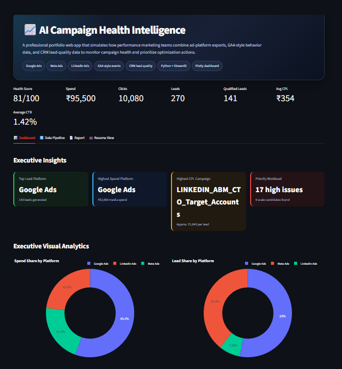
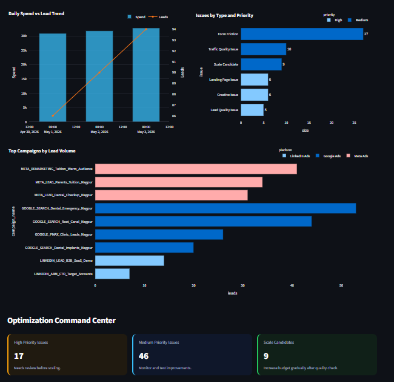
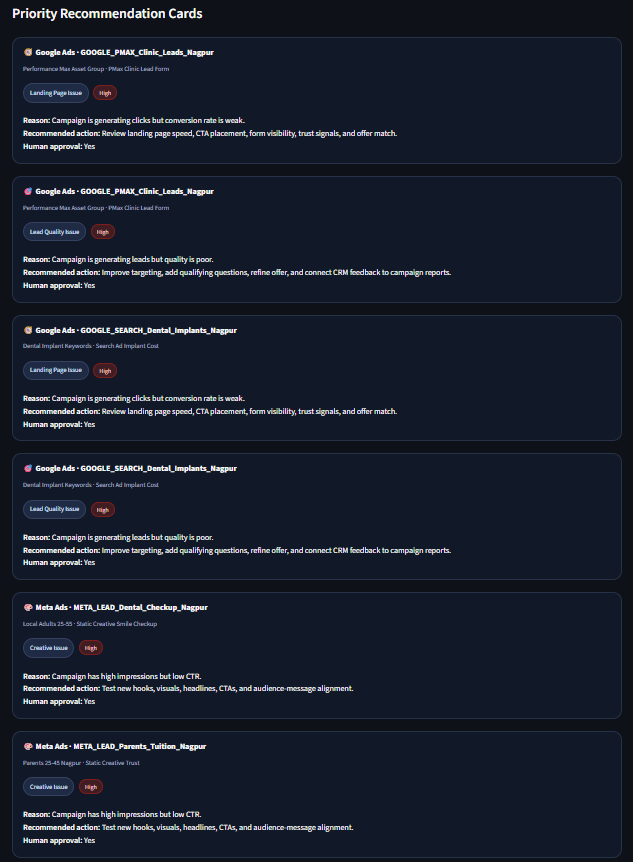
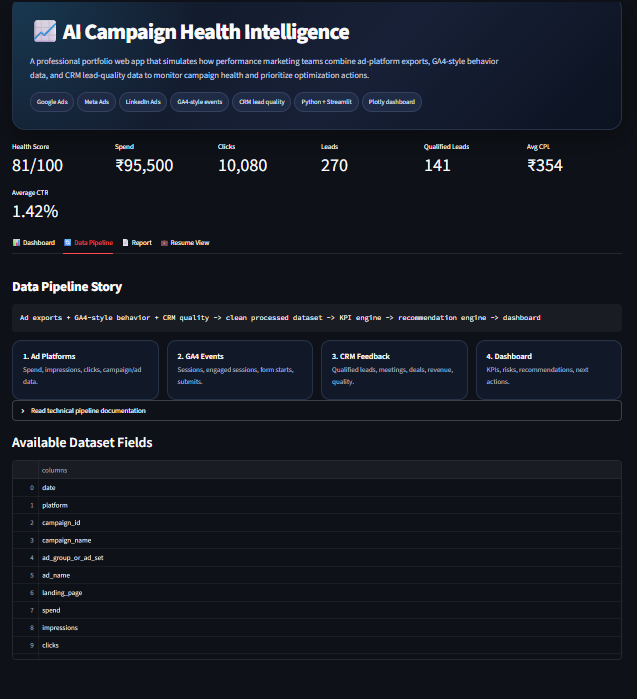
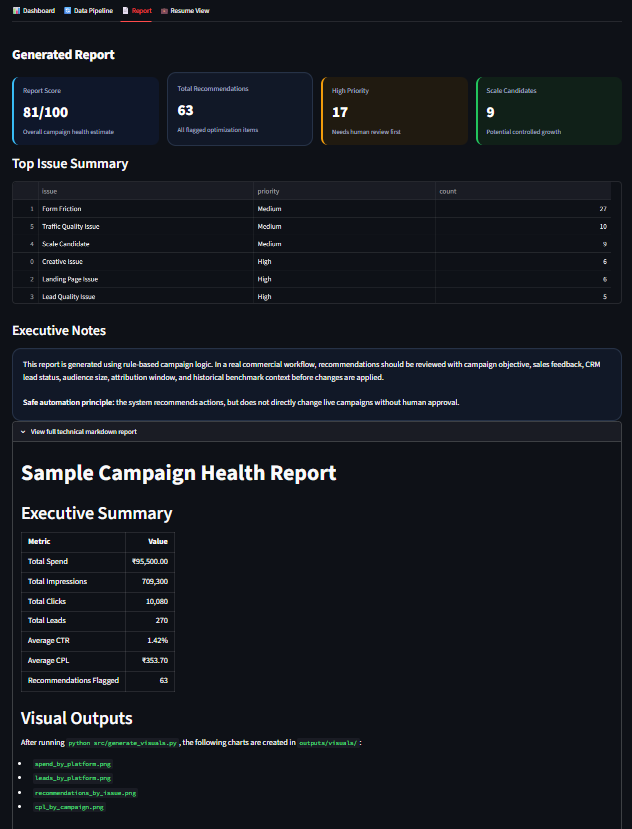
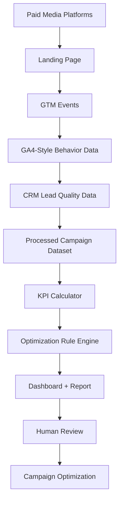
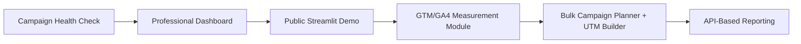

# 🚀 AI Performance Marketing Automation Lab

<p align="center">
  
</p>

<p align="center">
  
  
  
  
  
</p>

<p align="center">
  <a href="https://ai-performance-marketing-automation-lab-zzvxdwladc8tnrfaytvtxy.streamlit.app/"><strong>🚀 Live Demo: AI Campaign Health Intelligence</strong></a>
</p>

## Live App Preview


## 🎯 Project Overview

A practical performance marketing automation portfolio lab focused on campaign health checks, multi-source data analysis, KPI reporting, dashboarding, GTM/GA4 measurement planning, UTM governance, and human-approved optimization workflows.

The repository demonstrates how paid media, analytics, and CRM-style lead quality data can be converted into structured insights for campaign prioritization, reporting, and optimization decisions.

> **Core idea:** Campaign optimization should be driven by clean tracking, meaningful KPIs, lead quality signals, explainable recommendations, and human review before campaign changes are applied.

---

## 🖥️ Project 1: AI Campaign Health Intelligence

**Live app:** https://ai-performance-marketing-automation-lab-zzvxdwladc8tnrfaytvtxy.streamlit.app/

A functional Streamlit dashboard that simulates how a performance marketing team reviews campaign performance across Google Ads, Meta Ads, LinkedIn Ads, GA4-style behavior data, and CRM lead-quality data.

### What it does

- Combines multi-platform paid media data with GA4-style post-click behavior and CRM lead-quality signals
- Calculates key KPIs such as spend, impressions, clicks, CTR, CPL, qualified leads, and campaign health score
- Visualizes spend share, lead share, funnel movement, daily spend vs. leads, top campaigns, and issue priority
- Flags campaign issues such as landing page weakness, creative problems, form friction, traffic quality issues, and poor lead quality
- Generates safe, human-approved optimization recommendations

### Dashboard Preview

<p align="center">
  
</p>

<p align="center">
  
</p>

<p align="center">
  
</p>

<p align="center">
  
  
</p>

---

## 🧠 Workflow

```mermaid
flowchart LR
    A[Google Ads / Meta Ads / LinkedIn Ads] --> B[Ad Platform Data]
    B --> C[GA4-Style Behavior Data]
    C --> D[CRM Lead Quality Data]
    D --> E[Processed Campaign Dataset]
    E --> F[KPI Calculator]
    F --> G[Rule-Based Recommendation Engine]
    G --> H[Streamlit Dashboard]
    H --> I[Human Review]
    I --> J[Campaign Optimization Decision]
```



---

## 📦 Repository Modules

| Module | Purpose | Key Skills Demonstrated |
|---|---|---|
| [`01-ai-campaign-health-check-agent`](01-ai-campaign-health-check-agent/) | Analyze campaign performance and generate optimization recommendations | Python, Pandas, Plotly, Streamlit, KPI analysis, rule-based logic, reporting, dashboarding |
| `02-gtm-ga4-measurement-dashboard-system` | Design campaign measurement and dashboard structure | GTM, GA4 events, UTM strategy, conversion QA, dashboard planning |
| `03-bulk-campaign-planner-utm-builder` | Prepare scalable campaign launch templates | Campaign naming, UTM builder, bulk planning, pre-launch QA |
| [`docs`](docs/) | Shared documentation and SOPs | Process design, troubleshooting, documentation |
| [`assets`](assets/) | Screenshots, diagrams, and dashboard visuals | Portfolio presentation support |

---

## 🛠️ Tools & Skills Covered

| Category | Tools / Skills |
|---|---|
| Performance Marketing | Google Ads, Meta Ads, LinkedIn Campaigns, Remarketing, A/B Testing, Campaign QA |
| Tracking & Analytics | GTM, GA4, UTM Tracking, Enhanced Conversions concepts, Looker Studio planning |
| Automation & Data | Python, Pandas, Plotly, Matplotlib, Streamlit, CSV pipelines, Google Sheets workflow concepts |
| Reporting | KPI definitions, dashboard design, campaign reports, data visualization, executive summaries |
| Marketing Operations | Lead quality, budget pacing, funnel diagnosis, landing page issue detection, safe optimization workflow |
| AI-Assisted Workflow | Recommendation explanation, reporting summaries, campaign analysis support, human approval logic |

---

## 📊 Campaign Health Logic

| Signal | Possible Issue | Recommended Action |
|---|---|---|
| High spend + zero/low leads | Wasted spend or tracking issue | Check tracking, landing page, audience, keywords, and campaign setup before scaling |
| High impressions + low CTR | Creative or offer issue | Test new hooks, visuals, headlines, CTAs, and audience-message alignment |
| High clicks + low leads | Landing page issue | Review page speed, CTA clarity, form visibility, and offer match |
| High form starts + low submits | Form friction | Reduce fields, improve mobile form UX, check errors, and add trust elements |
| Low CPL + good lead quality | Scale candidate | Increase budget gradually while monitoring CPL and lead quality |
| Good lead volume + poor quality | Lead quality issue | Improve targeting, add qualifying questions, refine offer, and connect CRM feedback |

---

## 🏗️ System Architecture



---

## 📁 Project Status

| Area | Status |
|---|---|
| Repository setup | ✅ Done |
| Campaign health check module | ✅ Done |
| Multi-source sample data | ✅ Done |
| KPI calculator | ✅ Done |
| Rule engine | ✅ Done |
| Plotly dashboard visuals | ✅ Done |
| Streamlit public app | ✅ Done |
| Live Streamlit deployment | ✅ Done |
| Professional screenshots | ✅ Done |
| GTM/GA4 measurement module | ⏳ Upcoming |
| UTM builder module | ⏳ Upcoming |

---

## 🖼️ Current Outputs

Project 1 generates:

- [`campaign_kpis.csv`](01-ai-campaign-health-check-agent/outputs/campaign_kpis.csv)
- [`campaign_recommendations.csv`](01-ai-campaign-health-check-agent/outputs/campaign_recommendations.csv)
- [`sample-campaign-health-report.md`](01-ai-campaign-health-check-agent/outputs/sample-campaign-health-report.md)
- Campaign visual charts in [`outputs/visuals`](01-ai-campaign-health-check-agent/outputs/visuals/)
- Public Streamlit dashboard through [`public_app.py`](01-ai-campaign-health-check-agent/public_app.py)
- Local/private portfolio practice version through [`pro_app.py`](01-ai-campaign-health-check-agent/pro_app.py)

---

## ▶️ Run Project 1 Locally

```bash
cd 01-ai-campaign-health-check-agent
python -m pip install -r requirements.txt
python src/build_large_campaign_dataset.py
python src/calculate_kpis.py
python src/rule_engine.py
python src/generate_visuals.py
python -m streamlit run public_app.py
```

Use this version for public sharing:

```bash
python -m streamlit run public_app.py
```

Use this version for private learning/demo preparation:

```bash
python -m streamlit run pro_app.py
```

---

## 👨‍💼 Professional Use Case

This project is relevant for roles such as:

- Performance Marketing Executive
- Digital Marketing Executive
- Campaign Analyst
- Marketing Automation Executive
- Growth Marketing Associate
- Marketing Operations Associate
- Ads Operations Specialist
- B2B Lead Generation Specialist

---

## 🔐 Security Note

This repository uses sample/demo data only.

Do not commit:

- API keys
- Google Ads tokens
- Meta access tokens
- GA4 credentials
- `.env` files
- Service account JSON files
- Real client campaign data

---

## 🧭 Roadmap



---

## 📌 Portfolio Positioning

> **Performance marketing automation case study using paid media analytics, GA4-style tracking logic, CRM lead-quality signals, campaign health scoring, visual reporting, and safe human-approved optimization workflows.**
